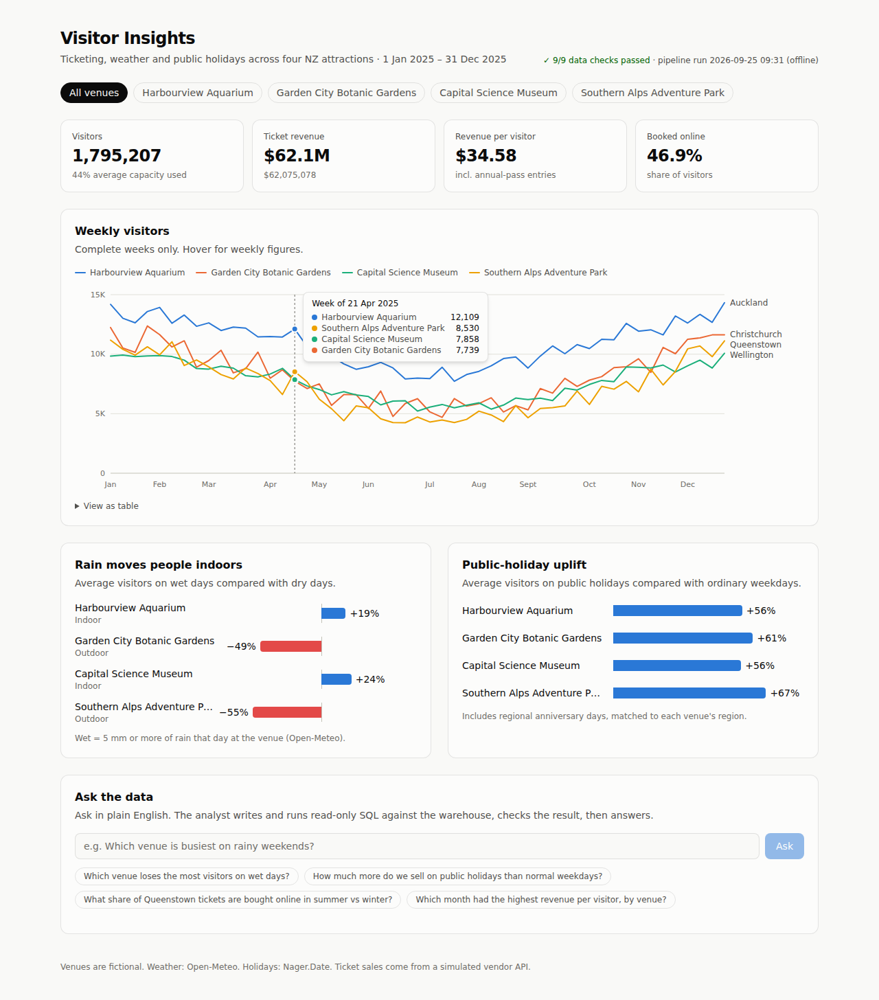

# Visitor Insights

An end-to-end analytics platform for visitor attractions. It has three parts:

1. **A data pipeline in Python and DuckDB.** It pulls data from three sources: daily weather from the Open-Meteo API, NZ public holidays from the Nager.Date API (including regional anniversary days), and a third-party ticketing vendor API that is paginated, flaky and messy. The data lands, is cleaned into a star schema and passes data-quality checks. It can then be published to **MotherDuck**.
2. **A dashboard in Next.js, TypeScript and Tailwind CSS.** It shows visitor trends, how weather affects demand, and how much public holidays lift it, with a venue filter.
3. **"Ask the data", an agentic AI analyst.** Claude writes SQL, runs it through a guard against the read-only warehouse, reads the results or errors, corrects itself if needed, and answers in plain English. The SQL it ran is shown next to the answer.



> The venues are fictional. Weather and holidays come from real public APIs in `--mode live`. Ticket sales come from a simulated vendor, because real attraction sales data isn't public. The simulated vendor behaves like a real one on purpose (see [Integration](#integration-the-ticketing-vendor)).

## Architecture

```
 Open-Meteo API ─┐
 Nager.Date API ─┼─► extract ─► landing/*.ndjson ─► raw.* ─► staging.* ─► marts.* ─► DQ checks ─┬─► dashboard (Next.js)
 Ticketing API  ─┘   (retries,    (audit copy of     (idempotent  (typed, de-  (star      (fail the run,  ├─► Claude SQL agent
                      pagination)  every extract)     reloads)     duplicated)  schema)    roll back)      └─► MotherDuck (--publish)
```

| Layer | What's there |
|---|---|
| `raw` | Source data as received. Vendor fields are stored as text. Each row is tagged with `_run_id` and `_loaded_at`. |
| `staging` | Views that normalise casing, parse `"NZD 1,234.50"` into a decimal, turn timestamps into dates, drop duplicates caused by overlapping pages, and expand regional holidays to the venues they apply to. |
| `marts` | `dim_venue`, `dim_date`, `fct_ticket_sales` (one row per venue/day/ticket type/channel) and `fct_daily_venue` (one row per venue per day, joined to weather and holidays). |
| `ops` | `pipeline_runs` (status and row counts for each run) and `dq_results` (the outcome of every check on every run). |

## Engineering decisions

- **Idempotent loads.** Each run replaces its own date window in `raw`, so re-running or backfilling never double-counts. This is tested.
- **A failed run changes nothing.** The load, transform and checks run in one transaction. If any `error`-level check fails, everything rolls back, so the marts stay at their last good state. The failed results are still written to `ops.dq_results`.
- **A landing zone.** Every extract is saved as NDJSON before it's loaded, so any number in the warehouse can be traced back to exactly what the source returned.
- **Data-quality checks catch real bugs.** The capacity check found an actual rounding bug in the ticket generator. It was fixed with largest-remainder allocation.
- **Offline mode.** Tests and CI run with no network access and produce the same output every time. Live mode uses the real APIs.

### Integration: the ticketing vendor

`TicketingClient` is written the way you'd integrate a real vendor reporting API:

- **Cursor pagination.** The client follows `next_cursor` until the vendor stops returning one.
- **Retries.** Transient 503s are retried with exponential backoff. The client gives up after N attempts.
- **Untrusted payloads.** The vendor mixes casing (`ADULT`, ` adult `), sends money as numbers or as strings like `"NZD 1,234.50"`, uses dates with and without timestamps, and sometimes repeats the last record of the previous page. All of this is handled in SQL staging, where it's visible and tested.

### The SQL agent and its security

The agent (`web/src/lib/agent.ts`) has one tool, `run_sql`. Several layers of defence stop it from doing damage:

1. **The SQL guard** (`sqlGuard.ts`). It allows a single `SELECT`/`WITH` statement only. It blocks DDL/DML, `ATTACH`/`COPY`/`INSTALL`/`PRAGMA`, file-reading functions (`read_csv`, `FROM 'file'`, `glob`), `getenv`, and every schema except `marts`. Keywords inside string literals can't trick it. Rejected queries go back to the model with the reason, so it can fix them.
2. **The database connection** is opened `READ_ONLY`, with `enable_external_access=false` and `lock_configuration=true`.
3. **Row limit.** Every query is wrapped in a `LIMIT` of 200 rows.
4. **Step limit.** The agent can make at most 6 tool calls. After that it's forced to answer.
5. **Rate limit and input checks** on the `/api/ask` route.

The agent's unit tests use a scripted fake client to cover: the normal flow, a rejected query that is never executed, self-correction after a database error, and the step limit.


## Running it

**Prerequisites:** Python 3.11+ and Node 22+.

```bash
# 1. Build the warehouse
cd pipeline
python -m venv .venv && source .venv/bin/activate
pip install -e ".[dev]"
pytest                                   # 20 tests
visitor-pipeline run --mode offline      # or: --mode live  (real weather + holidays)
#   -> pipeline/data/warehouse.duckdb, with each DQ check printed

# 2. Run the dashboard
cd ../web
cp .env.example .env.local               # add ANTHROPIC_API_KEY to enable "Ask the data"
npm install
npm run dev                              # http://localhost:3000
npm test                                 # SQL guard + agent tests
```

### Publishing to MotherDuck

```bash
export MOTHERDUCK_TOKEN=...              # from app.motherduck.com
visitor-pipeline run --mode live --publish
```

After this, set `MOTHERDUCK_TOKEN` (ideally a read-scaling token) in the web app's environment. The dashboard then queries `md:visitor_insights` instead of the local file, which is how it runs once deployed (for example on Vercel).

## Project layout

```
pipeline/
  visitor_pipeline/
    sources/       weather.py · holidays.py · ticketing.py (vendor + client)
    sql/           01_staging.sql · 02_marts.sql
    warehouse.py   landing zone + idempotent raw loads
    quality.py     data-quality checks
    pipeline.py    orchestration + transaction handling
    publish.py     MotherDuck publish
    cli.py
  tests/           source tests (no network) + end-to-end tests against DuckDB
web/
  src/app/         page.tsx (server component) · api/ask/route.ts
  src/lib/         db.ts · queries.ts · agent.ts · sqlGuard.ts
  src/components/  LineChart · ChangeBars · KpiTiles · AskPanel
.github/workflows/ci.yml   lint → test → build warehouse → test + build web
```

## Tech

Python · DuckDB · MotherDuck · SQL · REST API integration · pytest · ruff · Next.js (App Router) · React · TypeScript · Tailwind CSS · Anthropic Claude (tool use) · Vitest · GitHub Actions
